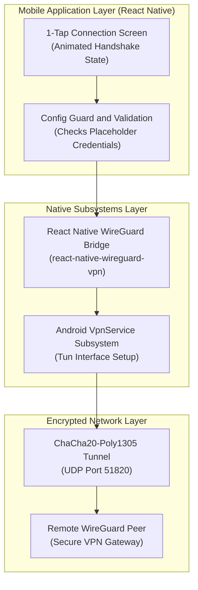

# 🛡️ ARBVPN — React Native WireGuard 1-Tap Client

[](LICENSE)
[](https://reactnative.dev/)
[](https://www.wireguard.com/)
[](https://developer.android.com/)

> ⚠️ **Configuration Required & Security Notice**:  
> For security, this open-source repository **does not include bundled server IP addresses or active private keys**. Before connecting, you must configure your own WireGuard server details in [`src/config/vpnConfig.ts`](./src/config/vpnConfig.ts). The mobile interface will automatically notify the user if placeholder values are detected.

---

## 🏛️ Features

- **1-Tap Connect & Disconnect:** Minimal, responsive mobile interface featuring visual connection states and animated feedback.
- **Native WireGuard Protocol:** Direct integration with native Android VPN subsystems via `react-native-wireguard-vpn`.
- **Decoupled Architecture:** Clean separation between connection state management, UI rendering, and cryptographic peer credentials.
- **Fail-Safe UI Guardrails:** The client inspects configuration integrity before attempting tunnel initialization, preventing crashes or silent connection drops.

---

## 🏛️ System Architecture



---

## 🚀 Quick Start & Setup

### 1. Prerequisites
- Node.js 20+
- Android Studio & Android SDK (for Android build)
- Java 17 (recommended for modern React Native Android toolchains)

### 2. Installation

```bash
# Clone repository
git clone https://github.com/Lukecele/ARBVPN.git
cd ARBVPN

# Install dependencies
npm install
```

### 3. Configure Your WireGuard Peer

Open `src/config/vpnConfig.ts` and replace the placeholder values with your WireGuard server credentials:

```typescript
export const DEFAULT_WG_CONFIG: WireGuardConfig = {
  privateKey: '<YOUR_CLIENT_PRIVATE_KEY>',
  publicKey: '<YOUR_SERVER_PUBLIC_KEY>',
  presharedKey: '', // Optional
  serverAddress: '<YOUR_SERVER_IP_OR_DOMAIN>',
  serverPort: 51820,
  address: '10.66.66.2/32',
  dns: ['1.1.1.1', '1.0.0.1'],
  allowedIPs: ['0.0.0.0/0', '::/0']
};
```

### 4. Run on Android Device / Emulator

```bash
npm run android
```

---

## 📜 License

Distributed under the [MIT License](./LICENSE). Open-source client for privacy-conscious mobile developers.
