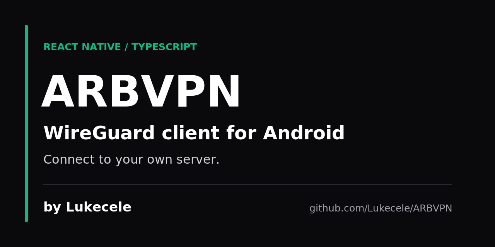

# Sharing ARBVPN

## Suggested repository settings

These values are prepared, **not applied**. The GitHub API reports no administration or push permission for the available identity. The current About text still says cross-platform and the current topics include iOS. No public homepage is configured or verified.

| Setting | Proposed value | Remaining action |
| --- | --- | --- |
| About description | React Native WireGuard client for Android. Connect to your own server. Built by Luca Celebrano (@Lukecele). | Replace the description using the gear beside About. |
| Topics | `wireguard`, `vpn-client`, `android`, `react-native`, `typescript`, `networking`, `mobile-app` | Replace the current topic list using the About editor. |
| Homepage | Empty | Keep the existing empty value. |
| Social preview | [social-card.png](assets/social-card.png) | Upload under Settings → General → Social preview. |

The seven proposed topics describe code present in the repository and satisfy GitHub's limit of 20 topics, 50 characters per topic, using lowercase letters, numbers, and hyphens. Android is the intended target; a successful native build or tunnel test is not claimed.

A Markdown banner does not configure GitHub's social preview. See GitHub's [topic rules](https://docs.github.com/en/repositories/managing-your-repositorys-settings-and-features/customizing-your-repository/classifying-your-repository-with-topics) and [social preview instructions](https://docs.github.com/en/repositories/managing-your-repositorys-settings-and-features/customizing-your-repository/customizing-your-repositorys-social-media-preview).

## Social card



- PNG: 1280 × 640, below 1 MB, with an opaque background for light and dark themes.
- Editable source: [social-card.svg](assets/social-card.svg). The dark background, green accent, and text colors come from `App.tsx`. Original typography-only artwork; no third-party images or invented logo.
- This is promotional artwork, not a screenshot. No keys, endpoint addresses, or connection claims appear in it.

To regenerate with CairoSVG installed:

```bash
python -m cairosvg docs/assets/social-card.svg -o docs/assets/social-card.png
```

## Short sharing copy

> ARBVPN is a React Native and TypeScript WireGuard client for Android, built by Luca Celebrano (@Lukecele). It explores a simple connect/disconnect interface for your own WireGuard server. Bring your own server and peer configuration. Explore the source, follow Lukecele, or star the project: https://github.com/Lukecele/ARBVPN

Draft only; this text has not been published.

## Screenshot follow-up

No native screenshot was captured: the documentation environment has no Java, Android SDK, or emulator, and the repository has no existing interface screenshots to reuse. On a configured Android environment, capture the actual setup screen without editing it into a connected state. For a configured-device capture, use a disposable test peer and exclude all credentials and sensitive addresses. Only describe a live connection after checking native tunnel state, a recent server-side handshake, and traffic through the tunnel; the current UI label alone is insufficient.
